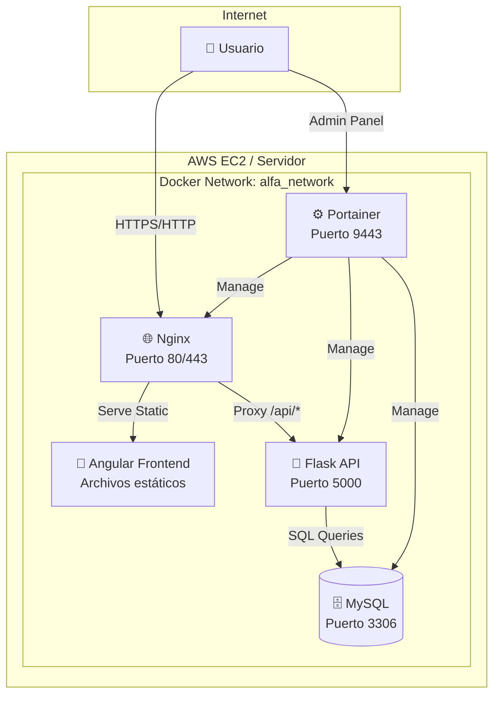

# 🚀 Alfa App - Guía Completa de Despliegue

Sistema completo de gestión con Angular Frontend, Flask API, MySQL Database y Portainer para administración.

## 📁 Estructura del Proyecto

```
Striker-dev/
├── 📂 alfa-frontend/          # Frontend Angular
├── 📂 alfa-test/             # Backend Flask API  
├── 🐳 docker-compose.yml     # Configuración principal
├── 🔧 nginx.conf            # Configuración Nginx
├── 🚀 deploy.sh             # Script de despliegue
├── 🔐 .env                  # Variables de entorno
├── 📋 EC2_DEPLOYMENT_GUIDE.md # Guía para AWS EC2
└── 📖 README_DEPLOYMENT.md   # Esta guía
```

## 🎯 Arquitectura de la Aplicación



## 🚀 Despliegue Rápido (5 minutos)

### Opción 1: Despliegue Local

```bash
# 1. Clonar repositorio
git clone <tu-repositorio>
cd Striker-dev

# 2. Construir frontend (si no está built)
cd alfa-frontend
npm install && npm run build
cd ..

# 3. Ejecutar despliegue
chmod +x deploy.sh
./deploy.sh
```

### Opción 2: Despliegue en EC2

```bash
# 1. Crear instancia EC2 (ver EC2_DEPLOYMENT_GUIDE.md)
# 2. Conectar via SSH
ssh -i tu-key.pem ubuntu@TU_IP_EC2

# 3. Instalar Docker
curl -fsSL https://get.docker.com | sh
sudo usermod -aG docker $USER

# 4. Subir proyecto y desplegar
scp -r ./Striker-dev ubuntu@TU_IP_EC2:~/
ssh ubuntu@TU_IP_EC2
cd Striker-dev
./deploy.sh
```

## 🌐 URLs de Acceso

| Servicio | URL Local | URL Producción | Descripción |
|----------|-----------|----------------|-------------|
| **Frontend** | https://localhost | https://tu-dominio.com | Aplicación Angular |
| **API** | http://localhost:5000 | http://tu-dominio.com:5000 | Backend Flask |
| **Portainer** | https://localhost:9443 | https://tu-dominio.com:9443 | Panel de administración |
| **Base de Datos** | localhost:3306 | Interno | MySQL (solo acceso interno) |

## 🔐 Credenciales por Defecto

### Portainer
- **Usuario**: `admin`
- **Contraseña**: Se genera automáticamente (ver output del script)

### Base de Datos MySQL
- **Host**: `mysql` (interno) / `localhost:3306` (externo)
- **Usuario**: `alfa_user`
- **Contraseña**: Definida en `.env`
- **Base de datos**: `alfa_db`

## 🛠️ Comandos Útiles

### Gestión de Servicios

```bash
# Ver estado
docker-compose ps

# Ver logs en tiempo real
docker-compose logs -f

# Reiniciar servicio específico
docker-compose restart alfa-frontend
docker-compose restart alfa-api

# Detener todos los servicios
docker-compose down

# Limpiar y reiniciar
docker-compose down -v
docker system prune -f
```

### Monitoreo

```bash
# Uso de recursos
docker stats

# Logs específicos
docker-compose logs -f alfa-frontend  # Frontend
docker-compose logs -f alfa-api       # API
docker-compose logs -f mysql          # Base de datos

# Acceso a contenedores
docker exec -it alfa_frontend sh      # Nginx
docker exec -it alfa_api bash         # API
docker exec -it alfa_mysql mysql -u root -p  # MySQL
```

### Backup y Restauración

```bash
# Backup de base de datos
docker exec alfa_mysql mysqldump -u root -p${MYSQL_ROOT_PASSWORD} alfa_db > backup_$(date +%Y%m%d_%H%M%S).sql

# Restaurar backup
docker exec -i alfa_mysql mysql -u root -p${MYSQL_ROOT_PASSWORD} alfa_db < backup_file.sql

# Backup de volúmenes
docker run --rm -v striker-dev_mysql_data:/data -v $(pwd):/backup alpine tar czf /backup/mysql_backup.tar.gz /data
```

## 🔧 Configuración Avanzada

### Variables de Entorno (.env)

```bash
# Base de Datos
MYSQL_ROOT_PASSWORD=tu_password_segura
MYSQL_DATABASE=alfa_db
MYSQL_USER=alfa_user
MYSQL_PASSWORD=tu_password_usuario

# Aplicación
FLASK_ENV=production
APP_SECRET_KEY=tu-clave-secreta-muy-larga

# Dominio (para SSL)
DOMAIN_NAME=tu-dominio.com
EMAIL=admin@tu-dominio.com
```

### Configuración SSL

#### Certificados Let's Encrypt (Producción)

```bash
# Instalar Certbot
sudo apt install certbot

# Obtener certificados
sudo certbot certonly --standalone -d tu-dominio.com

# Copiar a proyecto
sudo cp /etc/letsencrypt/live/tu-dominio.com/fullchain.pem ssl/cert.pem
sudo cp /etc/letsencrypt/live/tu-dominio.com/privkey.pem ssl/key.pem
```

#### Certificados Autofirmados (Desarrollo)

```bash
# Se generan automáticamente con deploy.sh
# O manualmente:
mkdir -p ssl
openssl req -x509 -nodes -days 365 -newkey rsa:2048 \
  -keyout ssl/key.pem -out ssl/cert.pem \
  -subj "/C=CO/ST=State/L=City/O=Alfa/CN=localhost"
```

### Personalizar Nginx

Editar `nginx.conf` para:
- Cambiar configuración de SSL
- Modificar headers de seguridad
- Ajustar configuración de cache
- Configurar rate limiting

### Escalabilidad

Para mayor tráfico, modifica `docker-compose.yml`:

```yaml
# Múltiples replicas del API
alfa-api:
  deploy:
    replicas: 3
  
# Load balancer
nginx:
  depends_on:
    - alfa-api
  # Configurar upstream con múltiples backends
```

## 🚨 Solución de Problemas

### Problemas Comunes

#### 1. Frontend no carga

```bash
# Verificar build
ls -la alfa-frontend/dist/alfa-frontend/browser/

# Reconstruir
cd alfa-frontend && npm run build && cd ..

# Verificar Nginx
docker-compose logs alfa-frontend
```

#### 2. API no responde

```bash
# Verificar logs
docker-compose logs alfa-api

# Verificar conexión a DB
docker exec alfa_api python -c "
import mysql.connector
conn = mysql.connector.connect(
    host='mysql', user='alfa_user', 
    password='tu_password', database='alfa_db'
)
print('DB OK' if conn.is_connected() else 'DB Error')
"
```

#### 3. Base de datos no inicia

```bash
# Verificar logs
docker-compose logs mysql

# Verificar volumen
docker volume ls | grep mysql

# Reiniciar limpio
docker-compose down -v
docker volume rm striker-dev_mysql_data
docker-compose up -d mysql
```

#### 4. Portainer no accesible

```bash
# Verificar puerto
netstat -tlnp | grep 9443

# Verificar logs
docker-compose logs portainer

# Resetear contraseña
docker-compose down portainer
rm portainer_password.txt
docker-compose up -d portainer
```

### Logs de Depuración

```bash
# Logs detallados
docker-compose logs --tail=100 -f

# Logs de sistema
sudo journalctl -u docker -f

# Verificar conectividad
curl -v http://localhost:5000/health
curl -k -v https://localhost/health
```

## 📊 Monitoreo y Métricas

### Con Portainer

1. Acceder a https://localhost:9443
2. Ir a "Containers" para ver estado
3. Click en contenedor para ver:
   - Logs en tiempo real
   - Estadísticas de recursos
   - Variables de entorno
   - Configuración de red

### Métricas del Sistema

```bash
# Uso de CPU y memoria
htop

# Uso de disco
df -h

# Estadísticas de Docker
docker system df
docker stats --no-stream
```

### Alertas Básicas

```bash
# Script de monitoreo simple
#!/bin/bash
# monitor.sh
while true; do
  if ! curl -f http://localhost:5000/health > /dev/null 2>&1; then
    echo "$(date): API DOWN" >> /var/log/alfa-monitor.log
    # Enviar notificación (email, slack, etc.)
  fi
  sleep 60
done
```

## 🔒 Seguridad

### Checklist de Seguridad

- [ ] Cambiar contraseñas por defecto
- [ ] Configurar SSL con certificados válidos
- [ ] Configurar firewall (UFW en Ubuntu)
- [ ] Actualizar sistema operativo regularmente
- [ ] Configurar backup automático
- [ ] Monitorear logs de acceso
- [ ] Configurar fail2ban para SSH
- [ ] Usar variables de entorno para secretos

### Hardening Adicional

```bash
# Configurar fail2ban
sudo apt install fail2ban
sudo systemctl enable fail2ban

# Configurar UFW
sudo ufw enable
sudo ufw default deny incoming
sudo ufw allow ssh
sudo ufw allow 80,443/tcp

# Actualización automática de seguridad
sudo apt install unattended-upgrades
sudo dpkg-reconfigure unattended-upgrades
```

## 📈 Performance

### Optimizaciones

1. **Frontend**:
   - Build con `--prod`
   - Compresión Gzip habilitada
   - Cache de archivos estáticos

2. **API**:
   - Conexiones de DB pooling
   - Cache de respuestas
   - Rate limiting

3. **Base de Datos**:
   - Índices optimizados
   - Configuración de memoria
   - Backup incremental

### Métricas de Performance

```bash
# Test de carga básico
curl -w "@curl-format.txt" -o /dev/null -s https://localhost/

# Donde curl-format.txt contiene:
#     time_namelookup:  %{time_namelookup}\n
#        time_connect:  %{time_connect}\n
#     time_appconnect:  %{time_appconnect}\n
#    time_pretransfer:  %{time_pretransfer}\n
#       time_redirect:  %{time_redirect}\n
#  time_starttransfer:  %{time_starttransfer}\n
#                     ----------\n
#          time_total:  %{time_total}\n
```

## 🆘 Soporte

### Recursos Útiles

- **Logs**: Siempre revisar logs primero
- **Portainer**: Panel visual para debugging
- **Health Checks**: Endpoints `/health` disponibles
- **Documentación**: Archivos `.md` en el proyecto

### Contacto

Para soporte técnico:
1. Revisar logs: `docker-compose logs`
2. Verificar estado: `docker-compose ps`
3. Consultar esta documentación
4. Crear issue en el repositorio

---

## 🎉 ¡Listo!

Tu aplicación Alfa está desplegada y lista para usar. Accede a:

- **🌐 Frontend**: https://localhost
- **⚙️ Admin Panel**: https://localhost:9443

¡Disfruta de tu aplicación! 🚀
